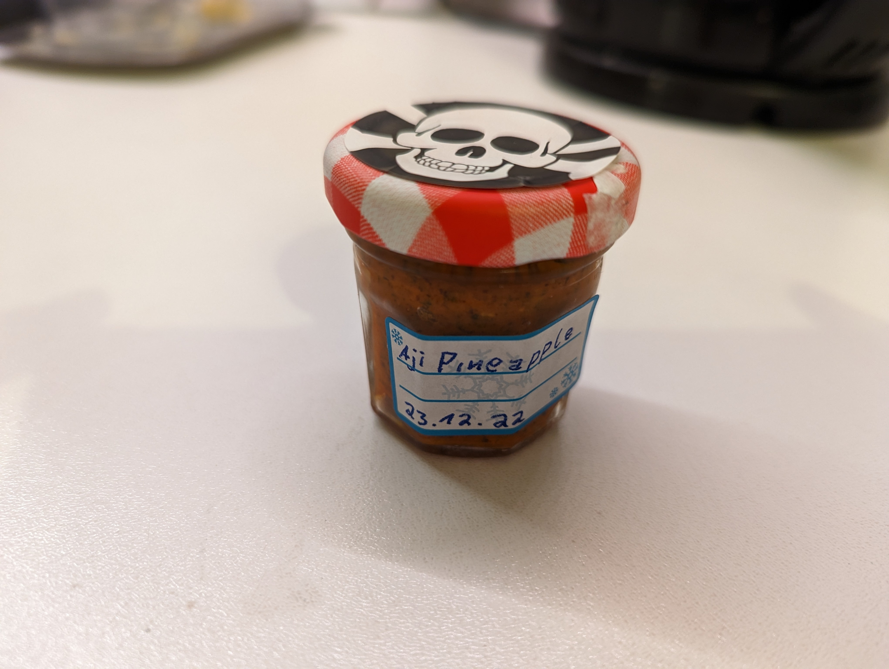

# Fermentierte Chilisauce

### Zutaten Fermentierung

- 30-60g Chilis (je nach Schärfe)
- 2-3 Zwiebeln
- 3-4 Knoblauchzehen
- 1-2 rote Paprika (kommt auf die Größe des Glases an. Paprika dient als Füllstoff.)
- 2-3%-ige Salzlake (20-30g Salz auf 1l Wasser)

Das Glas sollte maximal zu 3/4 mit Gemüse gefüllt sein. Wenn alle Zutaten im Glas sind die Steine oder Gläser zum Beschweren auf das Gemüse legen und mit der Salzlake auffüllen, bis alles bedeckt ist. 
Das Glas 3-5 Tage in einer dunklen und kühlen Ecke stehen lassen.
Danach nochmal ca. 4 Wochen im Kühlschrank fermentieren lassen.

## Zutaten

### Festzutaten Mörsern

Die folgenden Zutaten werden im Mörser zerkleinert.

- 15-20g Pfefferkörner 
- 15-20g Senfkörner (hell)
- 15-20g Senfkörner (dunkel)

### Ferment 

Das fermentierte Gemüse aus dem Glas schütten und abtropfen lassen. Das fermentierte Gemüse in den Mixer gegeben und pürieren. Es soll eine homogene Masse entstehen. 

Jetzt die gemörserten Zutaten mit unten folgenden Zutaten hinzugeben und vermischen. Je nach gewünschter Konsistenz die aufgefangene Lake dazugeben.

- 2-3 EL Apfelessig (abhängig von der Säure des Ferments)
- 2-3 EL Zucker
- 1 EL Koriander
- 1-2 TL Kurkuma

Alles in saubere (siehe oben) Gläser abfüllen, gut verschließen und im Kühlschrank lagern.

## Ideen

Senfkörner schon bei der Fermentierung mit in das Glas geben.