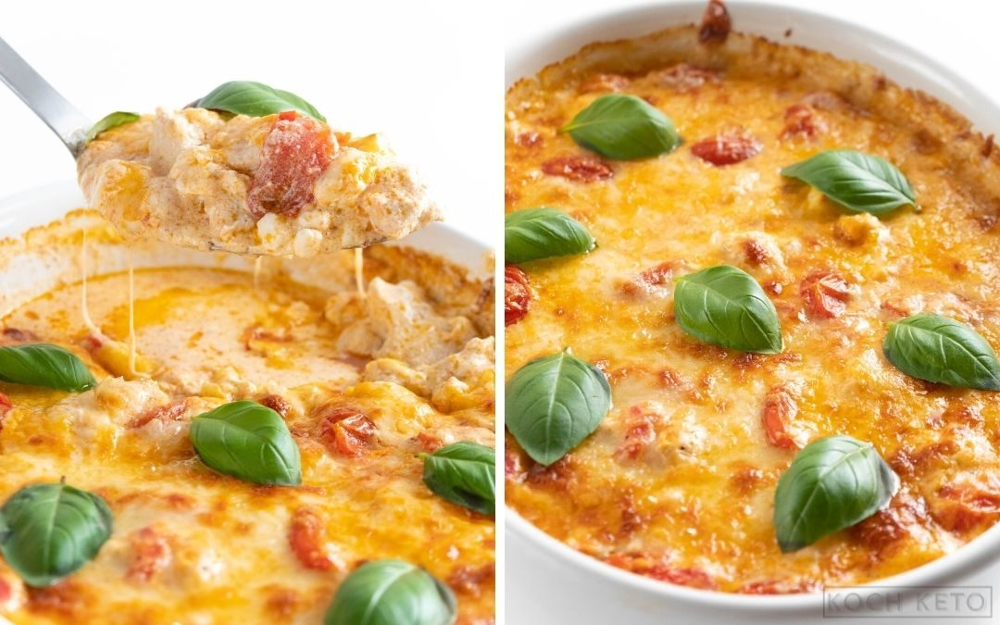

# Mediterraner Hähnchen-Feta Auflauf

## Nährwerte (pro Portion)

|            | Menge  |
|------------|--------|
| **KH**     | 3,8 g  |
| **Eiweiß** | 48,1 g |
| **Fett**   | 35,8 g |
| **Kcal.**  | 534    |

> **KH = verwertbare Kohlenhydrate**

# Zutaten

## Zutaten für den Auflauf
- 267 g Hähnchen-Innenfilet*
- 133 g Cocktailtomaten*
- 67 g Feta*
- 67 g geriebener Käse zum Überbacken*
- ⅔ EL Olivenöl*
- 1 ⅓ Knoblauchzehen
- frischer Basilikum* (optional)

## Zutaten für die Sauce
- 67 g Frischkäse*
- 33 ml Hühnerbrühe*
- ⅔ EL rotes Pesto*
- ⅛ TL Salz*
- ⅛ TL Pfeffer*

---

## Zubereitung

### 1. Schritt
Backofen auf **200 °C (Ober- und Unterhitze)** vorheizen.

---

### 2. Schritt  
**Zutaten:**  
- 267 g Hähnchen-Innenfilet*  
- 133 g Cocktailtomaten*  
- 67 g Feta*  
- 1 ⅓ Knoblauchzehen  

Das Hähnchen sowie den Feta in mundgerechte Stücke schneiden und die Cocktailtomaten halbieren.  
Den Knoblauch fein hacken.  
Alles gemeinsam mit dem Olivenöl in eine Auflaufform* geben und gut durchmischen.

---

### 3. Schritt
Die Auflaufform für etwa **20 Minuten** in den vorgeheizten Backofen geben, während die Sauce zubereitet wird.

---

### 4. Schritt  
**Zutaten:**  
- 67 g Frischkäse*  
- 33 ml Hühnerbrühe*  
- ⅔ EL rotes Pesto*  
- ⅛ TL Salz*  
- ⅛ TL Pfeffer*  

Etwa **10 Minuten bevor** der Timer für das Hähnchen ausläuft, die Zutaten für die Sauce in einen kleinen Topf geben.  
Alles bei mittlerer Hitze erhitzen, bis der Frischkäse geschmolzen ist und eine dickflüssige Sauce entsteht.

---

### 5. Schritt  
**Zutaten:**  
- 67 g geriebener Käse zum Überbacken*  

Nach den 20 Minuten die Auflaufform aus dem Ofen holen und die Sauce über den Auflauf gießen.  
Gut umrühren und anschließend den geriebenen Käse darüber streuen.

---

### 6. Schritt
Den Auflauf für ca. **15 Minuten** backen, bis der Käse schön goldbraun ist.

---

### 7. Schritt  
**Zutaten:**  
- frischer Basilikum* (optional)  

(Optional) Mit frischem Basilikum servieren.

---
